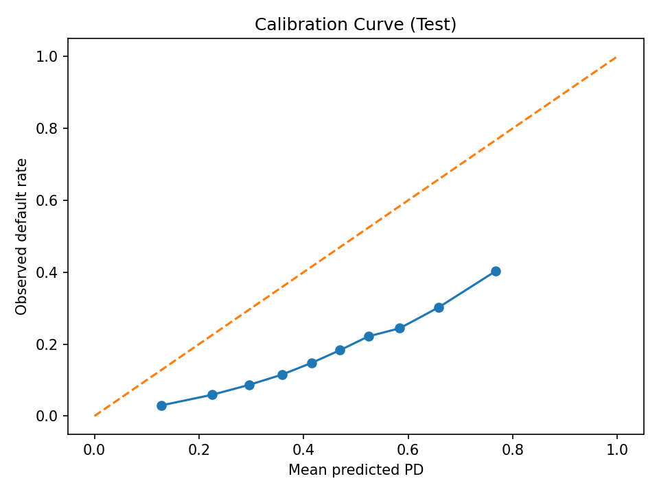
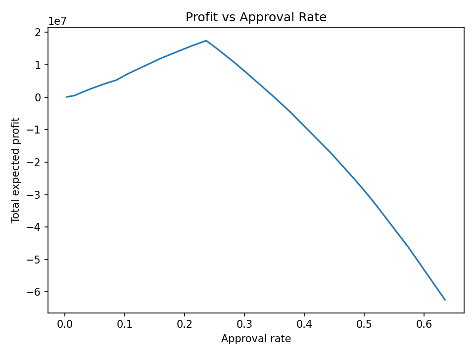
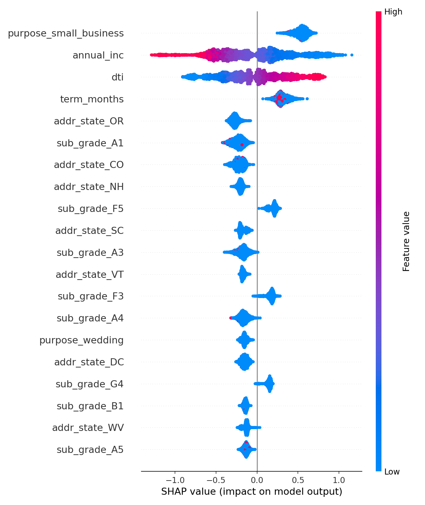

# 🏦 LendingClub Credit Risk (PD) & Pricing System — XGBoost

An **end-to-end, production-oriented credit risk modeling system** built on the LendingClub *Accepted Loans* dataset (2007–2018).

This project mirrors how a **real financial institution** designs, validates, explains, and deploys a **Probability of Default (PD) model**, combined with **risk-based approval and pricing**.  
The focus is on **governance, calibration, explainability, stability, and deployment discipline** — not Kaggle-style experimentation.

---

## 🔹 Project Summary

End-to-end credit risk system combining **PD prediction and risk-based pricing** using LendingClub data.  
Built with **XGBoost, calibration, SHAP explainability, PSI monitoring**, and deployed via **FastAPI + Streamlit** to reflect bank-grade practices.

---

## 🎯 Objectives

- Predict borrower **Probability of Default (PD)** using **XGBoost**
- Apply **risk-based approval decisions and APR pricing**
- Ensure **calibration, explainability, stability, and governance**
- Deliver **deployment-ready inference** via API and UI

---

## 📁 Data

Place the LendingClub dataset here:

```
data/accepted/accepted_2007_to_2018Q4.csv
```

### Target Definition
- **Default**: Charged Off, Default  
- **Non-default**: Fully Paid  
- **Dropped (ambiguous)**: Current, Late, In Grace Period

---

## 🔧 Modeling & Validation

- **Strict time-based split** by loan issue date
- Application-time features only
- **XGBoost classifier** with:
  - Class imbalance handling
  - **Monotonic constraints** aligned with credit risk logic  
    (e.g. higher DTI → higher risk, higher FICO → lower risk)
- Raw date fields excluded from modeling

---

## 📊 Model Performance

### Evaluation Results

**Validation**
```
AUC   : 0.7055
PR-AUC: 0.4114
Brier : 0.2170
```

**Test (Out-of-Time)**
```
AUC   : 0.7136
PR-AUC: 0.3381
Brier : 0.2107
```

---

### PD Buckets — Test Set

| PD Range | Count | Default Rate |
|--------|------:|-------------:|
| 2% – 5%   |   166 | 1.20% |
| 5% – 10%  | 2,090 | 1.29% |
| 10% – 20% | 8,415 | 3.58% |
| 20% – 100%|79,748 | 19.90% |

---

## 🎯 Calibration

Isotonic calibration applied on the validation set to improve probability accuracy.

**Calibrated Results**

**Validation**
```
AUC   : 0.7060
Brier : 0.1632
```

**Test**
```
AUC   : 0.7135
Brier : 0.1373
```

### Calibration Curve (Test)



---

## 💰 Decisioning & Pricing

- PD-based approve / decline logic
- Risk-based APR tiers
- Expected profit proxy using PD, LGD, funding cost, and operating expenses

### Profit vs Approval Rate



---

## 🧠 Explainability

- **SHAP (TreeExplainer)** for global and local explanations
- Feature effects align with economic intuition:
  - FICO score
  - Debt-to-income ratio
  - Income
  - Revolving utilization
- SHAP explanations use the **base (uncalibrated) model**

### SHAP Summary Plot



---

## 📈 Stability Monitoring (PSI)

Population Stability Index (PSI) computed between validation and test sets for all numeric features.

All PSI values are **well below common alert thresholds**, indicating stable data distributions.

---

## 🚀 Deployment

### FastAPI
- Real-time PD and pricing inference
- Pydantic input validation
- Shared inference pipeline with training
- Centralized decision logging

### Streamlit
- Interactive single-applicant scoring
- Displays PD, decision, APR, and expected profit proxy
- Local SHAP explanations in the UI

Both API and UI use the **same inference logic**, preventing train–serve skew.

---

## ▶️ How to Run

### Setup
```bash
git clone https://github.com/yourusername/credit-risk-pd-pricing.git
cd credit-risk-pd-pricing

python -m venv .venv
source .venv/bin/activate    # Windows: .venv\Scripts\activate
pip install -r requirements.txt
```

### Train model
```bash
python -m src.train
```

### Calibrate
```bash
python -m src.calibrate
```

### Evaluate
```bash
python -m src.evaluate
```

### PSI monitoring
```bash
python -m src.psi
```

### Explainability
```bash
python -m src.explain
```

### Profit curve
```bash
python -m src.profit_curve
```

### Run API
```bash
uvicorn src.app:app --reload
```

API docs:
```
http://127.0.0.1:8000/docs
```

### Run Streamlit UI
```bash
streamlit run streamlit_app.py
```

---

## 🧾 Conclusion & Takeaways

- The model demonstrates **stable out-of-time performance** with meaningful risk separation across PD bands.
- **Calibration materially improves probability accuracy**, which is essential for pricing and portfolio management.
- SHAP explanations confirm that model decisions align with **economic intuition** rather than spurious correlations.
- PSI analysis shows **no significant data drift** between validation and test periods.
- Profit analysis highlights the **risk–return tradeoff** inherent in approval threshold selection.
- The shared inference pipeline ensures **train–serve consistency**, a critical requirement in production credit systems.

---

## 🧱 Governance & Engineering Practices

- Time-based validation
- Monotonic constraints
- Isotonic calibration
- SHAP explainability
- PSI drift monitoring
- Schema enforcement
- Reproducible pipelines
- Centralized decision logging

---

## ⚠️ Disclaimer

This project is for **educational and portfolio purposes only**.  
It is **not intended for real-world lending decisions**.
